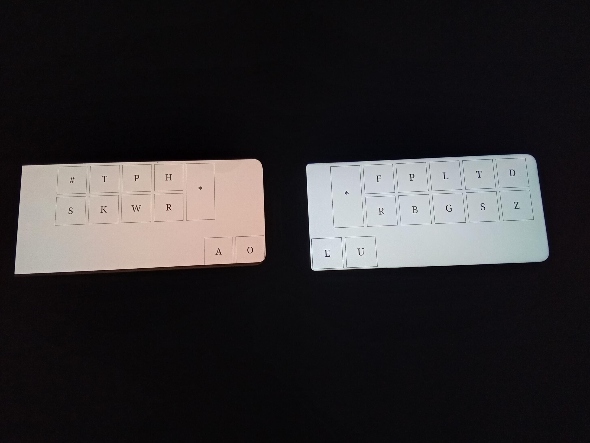
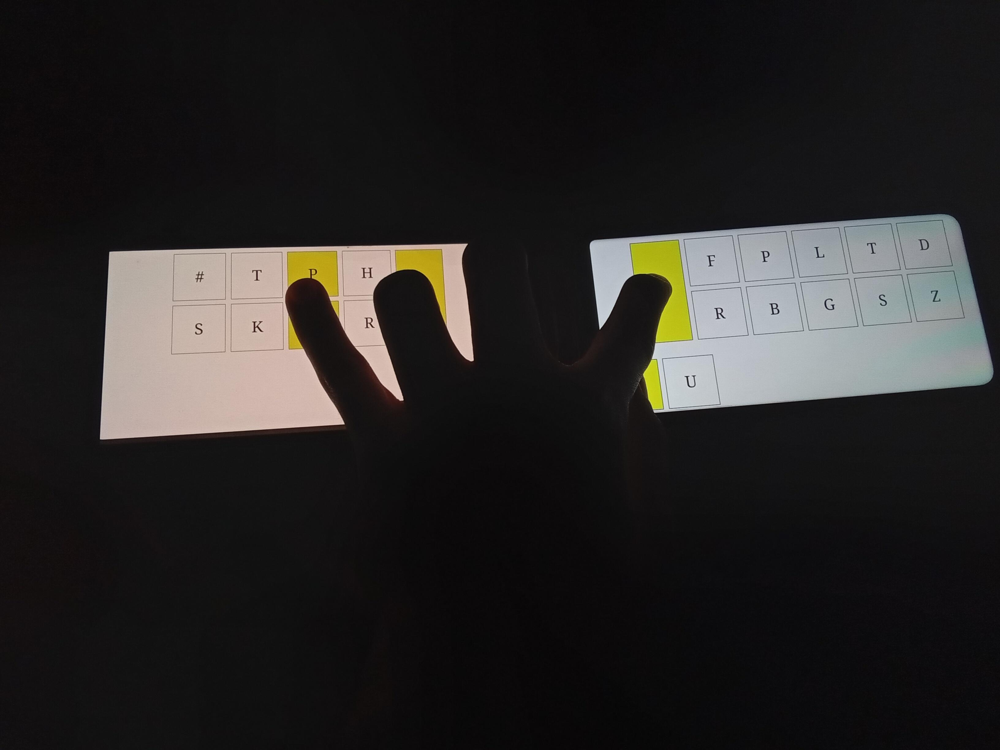

# TwoPhoneSteno



---

## Important Security Note

Although the server hosts and can serve the "index.html" file by default, it is recommended (for enhanced security) that you:
1. Download "index.html" onto each phone you intend to use.  
2. Open the downloaded file locally from each device.  

By doing so, you avoid relying on the server-served version of "index.html" and reduce the potential attack surface.

---

## Prerequisites

1. **Node.js and npm**  
   - Ensure you have a recent version of Node.js and npm installed.
   
2. **Project Dependencies**  
   - The project uses:
     - [libsodium-wrappers](https://www.npmjs.com/package/libsodium-wrappers)
     - [WebSocket (ws)](https://www.npmjs.com/package/ws)
   - You can install the above dependencies with:
     ```bash
     npm install
     ```

3. **socat (for serial emulation)**  
   - On Linux, install socat (if not already available):
     ```bash
     sudo apt-get update
     sudo apt-get install socat
     ```
   - This allows you to emulate a serial device.

---

## Quick Start

### 1. Clone the Repository

```bash
git clone https://github.com/huynhtrankhanh/TwoPhoneSteno.git
cd TwoPhoneSteno
```

### 2. Install Dependencies

```bash
npm install
```

### 3. Run the Server

From within the project directory:

```bash
node server.js /tmp/wowserial
```

- The argument `/tmp/wowserial` should match the path used in your socat command in the next step.
- The server will:
  - Start an HTTP server on port 8080 serving "index.html" from the project root.
  - Start a WebSocket server (also on port 8080) to handle real-time steno key events and encryption.
  - Provide an interactive confirmation prompt in the terminal to either accept or reject clients.

### 4. Create a Virtual Serial Device

To connect to Plover, you can emulate a serial interface as follows:

```bash
sudo socat -d -d pty,raw,echo=0,link=/dev/ttyS30,user=$(whoami),mode=600 UNIX-CONNECT:/tmp/wowserial
```

Adjust the paths or device names as desired.

The serial interface uses the TX Bolt protocol.

### 5. Download "index.html" and Open on Each Phone

1. Download the "index.html" file from the GitHub repository to each phone.  
2. Open "index.html" locally (e.g., by using the phone’s file browser or a local file path in the browser).  
3. Enter the desired WebSocket server address (e.g., `ws://<SERVER_HOSTNAME_OR_IP>:8080`) in the page’s connection UI.  

Select the correct half of the keyboard (`left` or `right`) and connect.

- Once connected, the server will display the fingerprint exchange prompt for verification.
- If you approve the prompt on the server side, real-time steno key events will be sent and converted into serial-like transmissions for steno processing.

---

## Technical Details

### Project Structure

1. **index.html**  
   - Main front-end page.  
   - Offers a touch-based steno keyboard UI split into left and right halves.  
   - Uses WebSockets to communicate with the Node.js server.  
   - Incorporates client-side encryption with libsodium.

2. **server.js**  
   - Runs an HTTP server to serve the HTML page (though direct local usage is more secure).  
   - Implements a WebSocket server to handle connections, encryption handshakes, and key events.  
   - Manages Unix socket communication to forward keystrokes to the emulated serial device.  

3. **libsodium-wrappers**  
   - Provides encryption/decryption and key exchange (crypto_kx) for secure communication between client and server.

4. **socat**  
   - Used to emulate a local serial device (`/dev/ttyS30` or any path you choose).  
   - Useful for debugging steno keystrokes without needing dedicated hardware.

### How the Keyboard Events Work

1. When a key (like "S" or "T") is pressed on the phone’s screen, it triggers a "press" event.  
2. The event is encrypted locally on the phone (client-side) and sent over the WebSocket.  
3. The server decrypts the message, identifies which steno key was pressed or released, and updates its internal state (`pressedKeys` and `currentStroke`).  
4. Once all pressed keys for a stroke are released, the server sends the completed stroke data through the Unix sockets to the emulated serial device.

### Fingerprint Verification

- On connection, the server sends its public key to the client and receives the client's public key.  
- Each public key’s fingerprint is derived via `crypto_generichash` and is displayed for manual verification.  
- Accepting the connection in the server console finalizes the secure channel.

---

## Troubleshooting

- **WebSocket Connection Fails**  
  - Ensure both phones and the server are on the same network.  
  - Verify the correct IP address and port (default 8080).  
- **Serial Emulation Issues**  
  - Check that socat is installed and running.  
  - Confirm the Unix socket path in `server.js` matches the path used in socat.
- **Encryption Errors**  
  - Make sure libsodium and libsodium-wrappers are installed correctly.  
  - Verify that both your phone's browser and Node.js environment can handle the encryption handshake.

---

## License

0BSD

---

**Remember:** For improved security, always download and open the "index.html" file locally on each phone rather than using the file served by the Node.js server.
